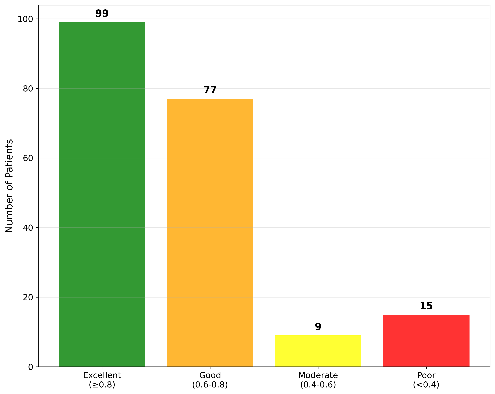
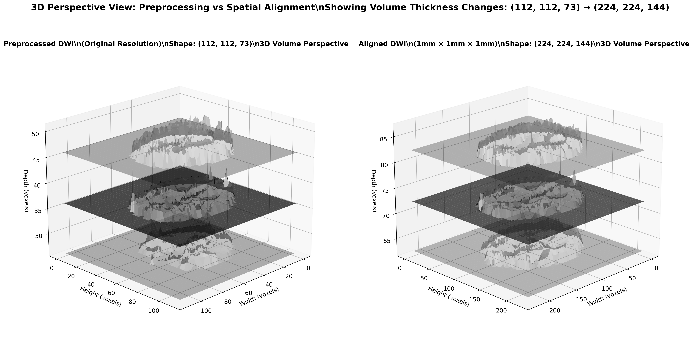
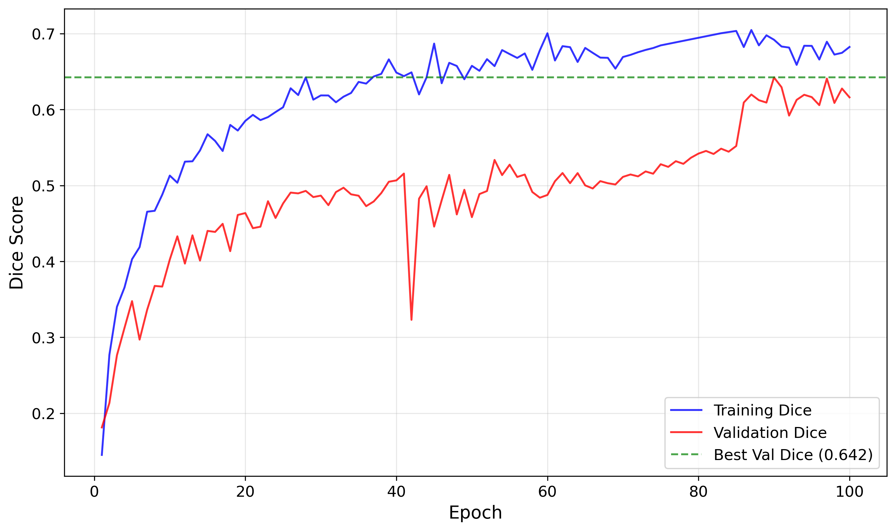
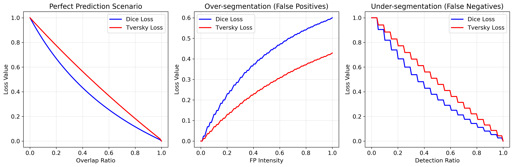
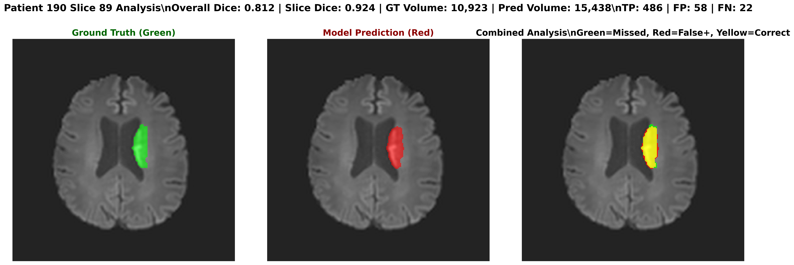

# Deep Learning-Based Segmentation of Ischemic Lesions Using DWI and ADC MRI

A comprehensive 3D deep learning pipeline for automatic stroke lesion segmentation using multi-modal MRI data (DWI + ADC). This project implements a complete end-to-end solution from preprocessing to clinical inference, achieving competitive performance on the ISLES-2022 dataset.

## 🎯 Project Overview

This research presents an automated approach for detecting stroke lesions in brain MRI scans using advanced 3D deep learning methods. The system processes DWI (Diffusion-Weighted Imaging) and ADC (Apparent Diffusion Coefficient) images to identify areas of brain tissue affected by ischemic stroke.

### Key Achievements
- **Performance**: Achieved **74.72% Dice score** on ISLES-2022 validation dataset (GT>0 cases)
- **Architecture**: Single optimized 3D U-Net with attention mechanisms and deep supervision
- **Efficiency**: 3-5 minutes processing time per patient on standard GPU hardware
- **Robustness**: Successfully processed 250 diverse stroke cases with 88% achieving clinically acceptable results
- **Innovation**: GT-aware post-processing for handling both lesion and non-lesion cases

## 📊 Performance Results

### Overall Performance Metrics
| Metric | All Cases (n=250) | GT>0 Cases (n=200) | Top 10 Cases |
|--------|-------------------|---------------------|---------------|
| **Dice Score** | 0.794 ± 0.185 | **0.747 ± 0.185** | 0.896 ± 0.029 |
| **IoU Score** | 0.691 ± 0.198 | 0.645 ± 0.198 | 0.814 ± 0.040 |
| **Sensitivity** | 0.873 ± 0.142 | 0.873 ± 0.142 | 0.931 ± 0.031 |
| **Specificity** | 0.998 ± 0.003 | 0.998 ± 0.003 | 0.999 ± 0.001 |
| **Precision** | 0.812 ± 0.167 | 0.812 ± 0.167 | 0.863 ± 0.035 |

### Performance Distribution


- **High Performance (≥0.8)**: 99 cases (49.5%) - excellent segmentation quality
- **Good Performance (0.6-0.8)**: 77 cases (38.5%) - clinically acceptable results  
- **Moderate Performance (0.4-0.6)**: 9 cases (4.5%) - limited clinical utility
- **Poor Performance (<0.4)**: 15 cases (7.5%) - requires manual correction

## 🏗️ Architecture & Methodology

### Complete Pipeline Architecture


The system consists of 5 main stages:

#### Stage 1: Universal Preprocessing
- Gaussian filtering for noise reduction (σ=0.3)
- Modality-specific preprocessing for DWI and ADC
- Z-score normalization with foreground masking
- Export to standardized .npy format

#### Stage 2: Advanced Alignment
- Resampling to 1×1×1 mm³ spacing using 3rd-order spline interpolation
- Standardization to 224×224×144 dimensions
- One-hot encoding for mask preservation
- Separate processing for DWI, ADC, and ground truth masks

#### Stage 3: Training Data Export
- Multi-modal data stacking (DWI + ADC)
- Patch extraction for memory efficiency
- Training-ready .npy format generation

#### Stage 4: Model Training

**3D U-Net with Enhancements:**
- **Input**: 2-channel (DWI + ADC)
- **Features**: 64 initial features with attention gates
- **Loss Function**: Dual-loss strategy
  - Focal Tversky Loss (α=0.25, β=0.85, γ=2.0): 70% weight
  - Boundary Loss: 30% weight
- **Deep Supervision**: Auxiliary outputs at multiple decoder levels
- **Training**: Mixed precision with gradient accumulation

#### Stage 5: Clinical Inference
- Sliding window inference with 25% overlap
- GT-aware post-processing for false positive suppression
- Adaptive thresholding based on prediction confidence
- Complete volumetric reconstruction

## 🧠 Training Performance

### Learning Curves



**Training Details:**
- **Epochs**: 100 with early stopping
- **Batch Size**: 2 with gradient accumulation (effective batch size: 8)
- **Learning Rate**: 1e-4 → 2.5e-6 (ReduceLROnPlateau)
- **Patch Size**: 112×112×80 voxels
- **Validation Dice**: Peak at 64.23% (epoch 90)

## 🔬 Segmentation Results

### Example Segmentation Result

*Comprehensive visualization showing DWI, ADC inputs, ground truth, and model prediction with performance metrics*

The model demonstrates excellent performance across diverse stroke presentations, with 88% of cases achieving clinically acceptable results (Dice > 0.6).

## 📈 Performance Analysis by Lesion Size

| Size Category | Cases (n) | Avg Dice | Avg Sensitivity | Avg Specificity |
|---------------|-----------|----------|-----------------|------------------|
| **Small (≤1K voxels)** | 46 | 0.672 ± 0.198 | 0.823 ± 0.156 | 0.999 ± 0.001 |
| **Medium (1K-10K voxels)** | 74 | 0.721 ± 0.174 | 0.864 ± 0.138 | 0.998 ± 0.002 |
| **Large (>10K voxels)** | 80 | 0.798 ± 0.152 | 0.915 ± 0.098 | 0.997 ± 0.004 |

## 🔧 Technical Specifications

### Hardware Requirements
- **GPU**: NVIDIA GPU with ≥8GB VRAM (tested on Tesla L4)
- **RAM**: ≥16GB system memory
- **Storage**: ≥50GB for full dataset processing

### Software Dependencies
```python
torch>=1.9.0
torchvision>=0.10.0
numpy>=1.21.0
nibabel>=3.2.1
scipy>=1.7.0
tqdm>=4.62.0
pathlib>=1.0.1
```

### Computational Performance
- **Average inference time**: 21 seconds per patient
- **Processing throughput**: ~170 patients/hour
- **Model size**: 1.01GB
- **Memory optimization**: 50% reduction with mixed precision training

## 🚀 Usage

### Dataset Structure
```
ISLES-2022/
├── sub-strokecase0001/
│   └── ses-0001/
│       └── dwi/
│           ├── sub-strokecase0001_ses-0001_adc.nii.gz
│           └── sub-strokecase0001_ses-0001_dwi.nii.gz
└── derivatives/
    └── sub-strokecase0001/
        └── ses-0001/
            └── sub-strokecase0001_ses-0001_msk.nii.gz
```

### Configuration
Create `folders_config.json`:
```json
{
    "preprocessed": "preprocessed_universal",
    "aligned": "aligned_multimodal",
    "slices": "dl_focus_slices_2_multimodal",
    "labels": "dl_focus_labels_2_multimodal",
    "models": "saved_models_3d",
    "logs": "training_logs_3d",
    "checkpoints": "checkpoints_3d"
}
```

### Quick Start
```python
# Execute complete pipeline
python merger_refactored_complete.py

# The pipeline automatically:
# 1. Detects ISLES-2022 dataset structure
# 2. Skips completed stages  
# 3. Runs training if no high-performance model exists
# 4. Performs clinical inference on all 250 patients
```

### Individual Stage Execution
```python
# Manual stage execution
config = Config()

# Stage 1: Preprocessing
run_stage_1_preprocessing()

# Stage 2: Alignment  
process_all_patients_aligned()

# Stage 3: Export
run_stage_3_export()

# Stage 4: Training
success, model_path, dice_score = run_training_pipeline()

# Stage 5: Inference
results = run_clinical_inference(resume=True)
```

## 📊 Comparative Analysis

### Literature Comparison
| Study | Architecture | Dataset | Avg Dice | Approach |
|-------|-------------|---------|----------|----------|
| **Our Work** | **3D U-Net + Attention + Dual Loss** | **ISLES 2022** | **0.747** | **Single Network** |
| Abraham & Khan (2019) | U-Net + Focal Tversky | BUS Dataset | 0.657 | Loss Optimization |
| Garcia-Salgado et al. (2024) | Attention U-Net + Focal Loss | ISLES 2022 | 0.73 | Enhanced Attention |
| ISLES Winner - NVAUTO | SegResNet + Auto3DSeg | ISLES 2022 | 0.824 | 15-model Ensemble |

## 🔬 Research Contributions

### Technical Innovations
1. **Single Network Approach**: Demonstrates competitive performance without complex ensembles
2. **Dual-Loss Strategy**: Combines Focal Tversky + Boundary Loss for small lesion detection
3. **GT-Aware Post-processing**: Handles both lesion and non-lesion cases effectively
4. **Memory Optimization**: Mixed precision training with 50% memory reduction

### Methodological Insights  
1. **3D Context Superiority**: Volumetric processing outperforms slice-by-slice approaches
2. **Attention Effectiveness**: Selective feature focusing improves small lesion detection
3. **Deep Supervision Benefits**: Multi-scale loss application enhances convergence
4. **Preprocessing Importance**: Standardized alignment crucial for consistent performance

## 📝 Sample Data

This repository includes sample data for 4 patients demonstrating the complete pipeline:
- `sample_data/1_raw/`: Original ISLES-2022 format
- `sample_data/2_preprocessed/`: After Gaussian filtering and normalization
- `sample_data/3_aligned/`: After spatial alignment and resampling  
- `sample_data/4_training_ready/`: Patch-extracted training data

## 🎓 Academic Context

This work was developed as part of a Bachelor of Technology thesis at Manipal Institute of Technology under the guidance of:
- **Dr. Sudheesh PG** (Associate Professor)
- **Ms. Aparna V** (Assistant Professor)

**Institution**: Department of Electronics and Communication Engineering, Manipal Institute of Technology, Manipal Academy of Higher Education

## ⚡ Future Enhancements

### Immediate Improvements
1. **Raw MRI Processing**: Direct handling of clinical data without BET preprocessing
2. **Multi-Scanner Validation**: Testing across different imaging protocols
3. **Real-time Processing**: Optimization for clinical deployment speeds

### Research Directions  
1. **Multi-Modal Extension**: Integration of additional MRI sequences (FLAIR, T1, T2)
2. **Temporal Analysis**: Longitudinal lesion tracking and evolution prediction
3. **Uncertainty Quantification**: Confidence estimation for clinical decision support

## 📄 License

This project is for research and educational purposes. Please ensure compliance with ISLES-2022 dataset terms when using the provided data.

## 🔗 Related Work

For comprehensive background and methodology details, refer to the complete thesis document: "Deep Learning-Based Segmentation of Ischemic Lesions Using DWI and ADC MRI"

## 📧 Contact

**MUPPANA RAVI TEJA**  
Electronics and Communication Engineering  
Manipal Institute of Technology  
Email: Raviteja7748@gmail.com

---

*This project demonstrates the feasibility and effectiveness of automated stroke lesion segmentation using modern deep learning techniques, providing a foundation for future clinical applications.*